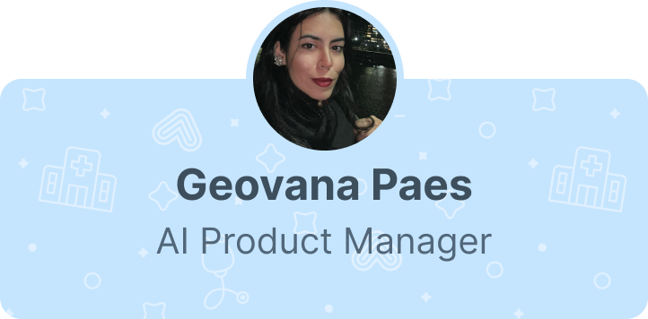

# Nova precificação da Meta para o WhatsApp (a partir de 1º de outubro de 2026)

30 de set. de 2026 · @geovanapaes

A mudança vale para todas as empresas que usam a API oficial do WhatsApp Business, independentemente do provedor.

Reunimos aqui o que muda, como isso aparece na rotina da clínica e o que você pode fazer no Amigo Flow para manter o custo do canal previsível.

### O que muda 

São duas mudanças principais:

1. **Mensagens de serviço passam a ser cobradas.** Cada número de WhatsApp tem 1.000 mensagens de serviço gratuitas por mês. A partir da 1.001ª, cada mensagem entregue é cobrada pela Meta, com o mesmo valor de uma mensagem de utilidade.
2. **Templates de utilidade dentro da janela são cobrados.** Antes, um segundo ou terceiro template de utilidade enviado com a janela aberta não era cobrado. Agora, cada template de utilidade é cobrado individualmente.

A janela de 24h continua existindo e funcionando da mesma forma. O que muda é o custo das mensagens enviadas dentro dela.

> A cota de 1.000 mensagens gratuitas conta **mensagens**, não pacientes nem conversas. Uma única conversa com cinco respostas consome cinco mensagens da cota.

### O que muda em cada categoria 

A Meta cobra por mensagem entregue, e o valor depende da categoria e do país do destinatário.

| Categoria    | O que é                                                                                              | Exemplo na clínica                      | Até 30/09/2026                               | A partir de 01/10/2026                                       |
| ------------ | ---------------------------------------------------------------------------------------------------- | --------------------------------------- | -------------------------------------------- | ------------------------------------------------------------ |
| Serviço      | Mensagem livre (sem template) enviada com a janela de 24h aberta: atendente, chatbot ou agente de IA | Recepção responde dúvida sobre convênio | Gratuita                                     | 1.000 gratuitas por número/mês; depois, cobrada por mensagem |
| Utilidade    | Template aprovado sobre algo que o paciente já contratou ou agendou                                  | Confirmação e lembrete de consulta      | Cobrada fora da janela; gratuita dentro dela | Cobrada sempre, por mensagem                                 |
| Marketing    | Template de divulgação, promoção ou reativação                                                       | Campanha de check-up anual              | Cobrada por mensagem                         | Sem mudança                                                  |
| Autenticação | Template com código de verificação                                                                   | Código de acesso ao portal do paciente  | Cobrada por mensagem                         | Sem mudança                                                  |

Mensagens recebidas dos pacientes continuam sem custo.

### Na prática: uma confirmação de consulta 

Veja como uma troca comum na clínica é contada antes e depois de 1º de outubro, considerando que a cota gratuita de serviço do mês já foi usada.

| Etapa             | Mensagem enviada pela clínica                      | Categoria  | Até 30/09                | A partir de 01/10 |
| ----------------- | -------------------------------------------------- | ---------- | ------------------------ | ----------------- |
| 1                 | Template de confirmação da consulta                | Utilidade  | Cobrada                  | Cobrada           |
| 2                 | Paciente responde “Confirmar”                      | (recebida) | Sem custo                | Sem custo         |
| 3                 | Template com endereço e orientações de preparo     | Utilidade  | Gratuita (janela aberta) | Cobrada           |
| 4                 | Atendente responde uma dúvida sobre estacionamento | Serviço    | Gratuita                 | Cobrada           |
| 5                 | Atendente envia “Até amanhã!”                      | Serviço    | Gratuita                 | Cobrada           |
| **Total cobrado** |                                                    |            | **1 mensagem**           | **4 mensagens**   |

Enquanto a clínica estiver dentro das 1.000 mensagens de serviço gratuitas do mês, as etapas 4 e 5 continuam sem custo. A etapa 3 é cobrada em qualquer caso, porque a cota gratuita vale só para mensagens de serviço.

### Perguntas frequentes 

#### A janela de 24h continua existindo? 

Sim. A janela abre sempre que o paciente envia uma mensagem para a clínica, por iniciativa própria ou respondendo a um template. Enquanto ela estiver aberta, sua equipe pode responder com mensagens livres. Fora dela, só é possível iniciar contato com templates aprovados.

#### Quais mensagens contam como serviço? 

Toda mensagem livre, sem template, enviada pela clínica com a janela aberta. Isso inclui respostas da recepção, mensagens de fluxos automatizados (árvore de decisão) e respostas de agentes de IA.

#### A cota de 1.000 mensagens vale para todos os meus números? 

A cota é por número. Se a clínica tem três números conectados, cada um tem suas próprias 1.000 mensagens de serviço gratuitas no mês. A cota se renova todo mês e o saldo não usado não acumula.

#### Existe desconto por volume nas mensagens de serviço? 

Não. Segundo a Meta, as mensagens de serviço são cobradas pelo valor padrão de utilidade do país, sem faixas de desconto por volume.

#### Conversas que começam por anúncios de clique para o WhatsApp são cobradas? 

Continuam com o benefício de janela gratuita, desde que a clínica responda o paciente nas primeiras 24h. Nesse período, as mensagens enviadas não têm custo. A regra da janela de 24h continua valendo: para seguir respondendo com mensagens livres, a última mensagem do paciente precisa ter menos de 24h.

#### Chatbots e agentes de IA também geram custo? 

Sim. Toda resposta enviada por automação conta como mensagem de serviço, igual à de um atendente. Fluxos com muitas mensagens em sequência consomem a cota mais rápido.

Fluxos de árvore de decisão tendem a ter um número previsível de mensagens por atendimento. Agentes de IA variam mais, porque o volume depende de cada conversa.

#### Mensagens enviadas pelo app WhatsApp Business são cobradas? 

Não. A cobrança vale só para mensagens enviadas pela API oficial, como as que saem pelo Amigo Flow. Mensagens enviadas diretamente pelo aplicativo WhatsApp Business no celular não entram nessa cobrança.

### Como manter o custo previsível no Amigo Flow 

Como a cobrança agora é por mensagem, o caminho mais eficiente é dizer o mesmo com menos envios. Sugerimos quatro revisões:

* **Junte mensagens que andam juntas.** Quebrar uma resposta em várias mensagens curtas multiplica o custo. Uma mensagem completa custa menos que três pela metade.
* **Revise seus Envios Automáticos.** Se a confirmação de consulta é seguida de outro template com endereço ou preparo, avalie reunir as informações em um único template. Cada template de utilidade passa a ser cobrado.
* **Enxugue os fluxos de atendimento.** Revise as automações que enviam várias mensagens seguidas e retire etapas que não ajudam o paciente a resolver o que precisa.
* **Use botões sempre que fizer sentido.** Botões como Confirmar, Agendar e Reagendar levam o paciente direto à ação e evitam trocas de mensagens para entender o que ele quer.
* **Troque o agendamento pelo agente pelo agendamento via link (Agende.ai).** Ao invés de gastar com um fluxo grande de agendamento, gaste apenas uma mensagem com o link do agende.ai prontinho para o usuário se auto-agendar.

Acompanhe o volume de mensagens por categoria no painel de consumo do Amigo Flow. Assim você identifica quais fluxos e envios mais pesam no mês e onde vale ajustar. (disponível a partir da cobrança de Outubro).

### Precisa de ajuda? 

Se tiver dúvidas sobre a nova precificação ou quiser ajuda para revisar seus fluxos e envios, fale com o nosso suporte. Nosso time está à disposição para te ajudar a aproveitar o WhatsApp com mais eficiência.

<figure><figcaption></figcaption></figure>

