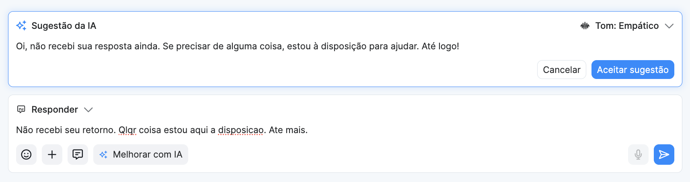

# Melhorar resposta com IA

#### O que é

O Amigo Flow agora oferece melhorias de resposta geradas por Inteligência Artificial diretamente no chat de atendimento. A IA analisa o texto digitado e sugere uma resposta melhorada, mas **nada é enviado sem a revisão e aprovação do atendente**.

#### Por que isso importa

Atendentes lidam com dezenas de conversas simultâneas e precisam responder com agilidade, consistência e empatia. A sugestão de IA funciona como um assistente de escrita que propõe a mensagem certa no momento certo, reduzindo o tempo de composição e o esforço cognitivo — sem tirar o controle das mãos de quem atende.

#### Como usar

**Passo 1 — Acionar a sugestão**

Com o foco no campo de digitação de mensagem, escreva **ao menos 3 palavras** de contexto ou rascunho e clique no **botão de Melhorar com IA** disponível na barra do campo de mensagem.

**Passo 2 — Aguardar o carregamento**

Um painel aparecerá acima do campo de mensagem com uma animação de carregamento. O campo de digitação continua ativo, mas você deve aguardar a sugestão.

> Se você digitar algo enquanto a IA processa, a sugestão em andamento será descartada automaticamente.

**Passo 3 — Revisar a sugestão**

Quando a IA terminar, o painel exibirá:

* O texto sugerido
* O **tom de voz** utilizado na geração (ex: _"Tom de voz: Empático"_)
* Os botões **"Cancelar"** e **"Aceitar sugestão"**

**Passo 4 — Aceitar ou cancelar**

* **Aceitar sugestão:** o texto é inserido no campo de digitação para que você edite e envie quando quiser.
* **Cancelar:** o painel fecha e o campo volta ao estado anterior, preservando o que você havia digitado.

> ✅ **Lembre-se:** a mensagem **nunca é enviada automaticamente**. Você sempre tem a última palavra.

<figure><figcaption></figcaption></figure>

#### Tom de voz

Antes de acionar a sugestão, você pode escolher o tom que a IA deve usar:

| Tom                   | Quando usar                                                                       |
| --------------------- | --------------------------------------------------------------------------------- |
| **Empático** (padrão) | Situações sensíveis, pacientes ansiosos ou com dúvidas emocionais                 |
| **Objetivo**          | Confirmações, lembretes, respostas práticas                                       |
| **Formal**            | Comunicações com pessoas mais idosas, ou situações que exijam um tom mais formal. |

O tom selecionado fica salvo durante toda a sessão, ao trocar de conversa, ele é mantido.

#### Limite de uso

Cada atendente pode usar a sugestão de IA até **20 vezes por período de 24 horas**, contabilizado individualmente por clínica. Ao atingir o limite, uma mensagem informativa será exibida. O contador é renovado automaticamente após 24 horas do primeiro uso do período vigente.

#### Onde está disponível

A sugestão de IA está disponível **somente em conversas ativas no módulo Meus Chats**. Não está disponível em notas internas, disparos em massa ou outros módulos.

#### Perguntas frequentes

**O paciente sabe que a resposta foi gerada por IA?** Não. A mensagem que chega ao paciente é aquela que o atendente escolhe enviar, seja ela editada ou não.

**O que acontece se a IA não conseguir gerar uma resposta?** O painel exibirá uma mensagem de erro amigável com a opção de tentar novamente. O campo de mensagem não é bloqueado.

**Posso usar a sugestão em qualquer conversa?** Apenas em conversas ativas no módulo de Chat (Meus Chats). O chat flutuante e outros módulos não têm acesso a esta funcionalidade.

