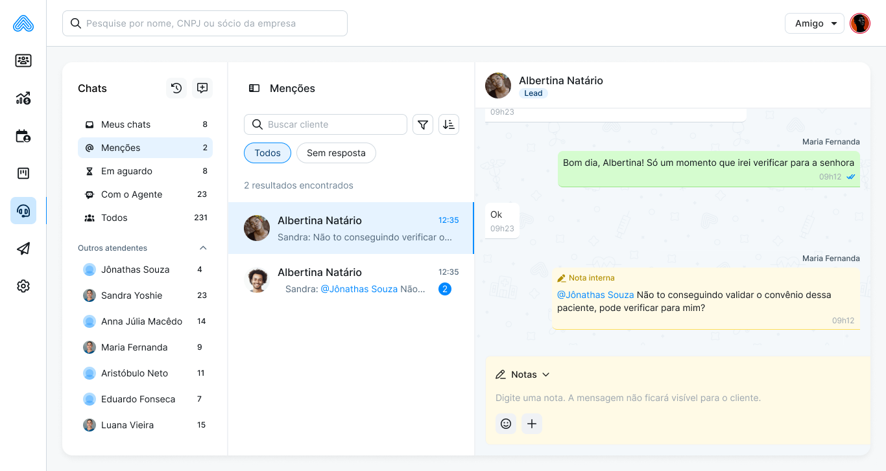

# Menções

A colaboração entre atendentes ficou mais direta. Agora é possível mencionar um colega em uma nota interna usando `@` — e ele recebe o aviso na hora.

**O que mudou:**

* Digite `@` no modo **Nota** para buscar e mencionar um colega do workspace
* A menção só funciona quando o `@` está no início do campo — sem texto antes dele
* Não é possível mencionar a si mesmo ou mencionar no modo **Responder** (apenas em Notas)

**Nova seção: Menções**

Uma nova seção lateral foi adicionada ao Flow, centralizando todas as notas em que você foi mencionado. Sem precisar procurar atendimento por atendimento.

Cada card exibe:

* Nome do cliente/atendimento
* Quem fez a menção e quando
* Trecho da nota com o contexto

Ao clicar no card, o atendimento abre direto na menção mais antiga — e o modo padrão já vem como **Notas**, pronto para você responder.

**Contador no sidebar:** O número exibido reflete a quantidade de atendimentos em andamento com menções ao seu usuário. Ele zera quando todos os atendimentos relacionados são encerrados.

> Essa funcionalidade facilita a comunicação interna sem sair do atendimento — ideal para acionar um colega, tirar dúvidas ou passar contexto sem o paciente ver.

<figure><figcaption></figcaption></figure>
