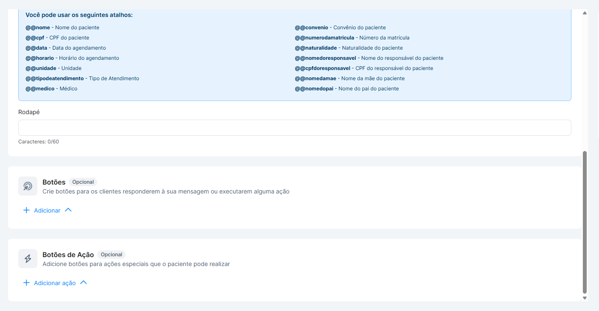

# Botões de Ação nos Templates do Amigo Flow (WhatsApp API)

Agora sua clínica pode adicionar botões interativos aos templates de mensagem que executam ações diretamente no sistema — sem que o atendente precise interpretar a resposta do paciente e fazer nada manualmente.

Essa nova funcionalidade permite:

* adicionar botões de ação ao criar ou editar um template,
* escolher o tipo de botão e a ação que ele executa,
* personalizar o texto exibido para o paciente,
* e registrar automaticamente cada ação no histórico da conversa.

Tudo isso dentro do próprio construtor de mensagens do Amigo Flow. 

### Tutorial — Como adicionar botões de ação a um template

### 1️⃣ Acessando o Criador de Templates

No menu de Mensagens / Modelos do Amigo Flow, selecione "Criar modelo" (ou edite um modelo já existente).

Você verá a área de edição do template com:

* Corpo do texto
* Cabeçalho (se aplicável)
* Preview à direita em tempo real

### 2️⃣ Adicionando um Botão de Ação

Na área de edição, abaixo do corpo da mensagem, clique no botão:

**➕ Adicionar ação**

 

 

Isso abrirá um menu com os tipos de botão disponíveis:

| Botão              | O que acontece quando o paciente clica                        |
| ------------------ | ------------------------------------------------------------- |
| Confirmar consulta | Status da agenda atualizado para "Confirmado" automaticamente |
| Cancelar consulta  | Status da agenda atualizado para "Cancelado" automaticamente  |
| Assinar documento  | Fluxo de assinatura pelo Signbox é aberto                     |

\
&#xNAN;**✔️ Regras importantes**

* Cada tipo de botão já vem com a ação vinculada por padrão — não é possível alterar qual ação um botão executa.
* A validação impede que o template seja salvo sem pelo menos o tipo de botão selecionado.
* Ao escolher o botão, ele entra na lista do template pronto para uso.

### 3️⃣ Personalizando o Texto do Botão

Depois de escolher o tipo, você pode editar o rótulo exibido ao paciente no WhatsApp.

**Como funciona:**

* Clique sobre o botão adicionado para editar o texto exibido
* O texto é livre — você pode trocar "Confirmar consulta" por algo como "Confirmar presença ✅"
* A ação vinculada ao botão continua a mesma, independente do texto escolhido 

### 4️⃣ Editando ou Removendo Botões

**✔️ Remover**

* Na área de botões do template, basta excluir o botão adicionado

**✔️ Editar**

* Basta clicar sobre o botão e ajustar o texto exibido

### 5️⃣ Preview em Tempo Real

À direita, o painel de preview mostra exatamente como o botão será exibido para o paciente no WhatsApp.

**O preview:**

* Atualiza automaticamente a cada alteração
* Permite validar imediatamente o texto e a posição do botão na mensagem

Isso reduz erros e ajuda a confirmar a experiência antes de enviar para aprovação.

### 6️⃣ Validação Antes de Salvar ou Enviar

Antes de permitir salvar ou enviar o template para aprovação, o sistema verificará:

**✔️ Configuração correta dos botões**

* Tipo de botão selecionado
* Texto do botão preenchido

### 7️⃣ Como a Ação é Executada

Depois que o template é aprovado e enviado ao paciente, a ação acontece assim:

1. O paciente clica no botão diretamente na conversa do WhatsApp
2. O Flow recebe a ação
3. O sistema identifica a ação associada ao botão e executa automaticamente — atualiza a agenda, abre o link, ou inicia o fluxo do Signbox, dependendo do tipo de botão
4. O sistema retorna uma confirmação ao paciente
5. A ação é registrada no histórico da conversa do paciente

**✔️ Regras importantes**

* Cada botão está vinculado a apenas uma ação. Para cobrir mais de uma ação na mesma mensagem, é necessário adicionar mais de um botão ao template.
* O registro no histórico é feito automaticamente pelo Flow, sem necessidade de ação do atendente.
